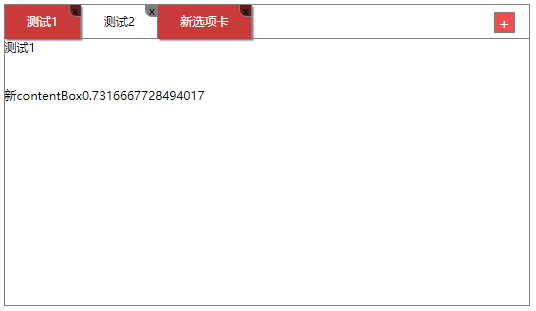
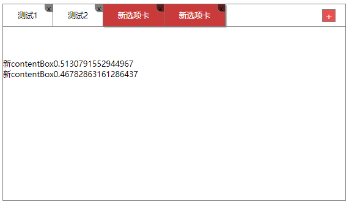
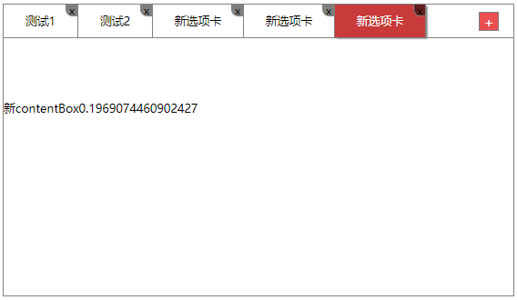
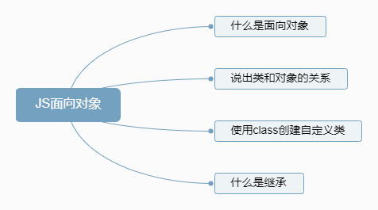
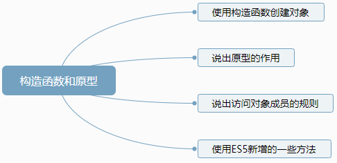
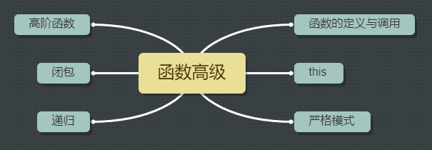

#	JavaScript高级 #

## JavaScript面向对象 ##

###  面向对象编程介绍 ###

**两大编程思想：**

- 面向过程：分析出解决问题所需要的的步骤，然后用函数把这些步骤一步一步实现，使用的时候再一个一个的依次
- 面向对象:   把事务分解成为一个个对象，然后由对象之间分工与合作。

**面向对象的特性：**

- 封装性
- 继承性
- 多态性

### 类和对象 ###

​	面向对象更贴近我们的实际生活，可以使用面向对象描述现实世界事物。但是事物分为具体事物和抽象事物。

    
     
    抽象的人

    
     
    具体的人

**面向对象的思维特点**

- 抽取（抽象）对象共用的属性和行为组织（封装）成一个类（模板）。
- 对类进行实例化，获取类的对象。

**对象**

”万物皆对象“，现实生活中所有的东西都能是对象，也能被我们抽象成一类，写在代码中。

对象是由  **属性**  和 **方法** 组成的。

**类  Class**

在 ES6 中新增了类的概念，可以使用 **class**关键字声明一个类，之后以这个类来实例化对象。

**类**抽象了对象的公共部分，它泛指某一大类（class）

**对象**特指某一个，通过类实例化一个具体的对象。

### 创建类和实例化对象 ###

*语法：*

~~~JavaScript
// 定义类
class Name {
    // class body
}
// 使用 new 关键字创建实例
var xx = new Name();
~~~

*注意：*

> 通过class关键字创建类，类名我们定义首字母大写
>
> 类里面有个constructor函数，可以接受传递过来的参数，同时返回实例对象
>
> 通过new实例化对象时，constructor函数自动被调用，如果不写这个函数，类也会自动生成这个函数
>
> 生成实例 new 不能省略
>
> 创建类时，类名后面不加小括号，生成实例时，类名后面加小括号，构造函数不需要加 function

**类constructor构造函数**

constructor() 方法是类的构造函数（默认方法），用于**传递参数，返回实例对象**，通过 new 命令生成对象实例时，自动调用该方法。如果没有显示定义，类内部会自动给我们创建一个 constructor()

### 类中添加方法 ###

*语法：*

~~~javascript
// 定义类
class Student {
    constructor(name,age){
        this.name = name;
        this.age = age;
    }
    sing(song){
        console.log(this.name + song)
    }
}

// 实例化类
var student1 = new Student('张三',20)
var student2 = new Student('李四',21)

// 调用方法
student1.sing('蓝莲花')
student2.sing('晴天')
~~~

### 类继承extends和super关键字 ###

现实生活中的继承：子承父业，比如我们都继承了父亲的姓。

程序中的继承：子类可以继承父类的一些属性和方法。

~~~JavaScript
// 父类
class Father {
    say(){
        console.log('say something')
    }
}

// 子类继承父类
class Son extends Father{
    
}
~~~

当父类的方法中使用了父类的属性时，需要在子类的构造函数中，使用super()方法

### super关键字 ###

:heart: super 关键字用于访问和调用对象父类上的函数。可以调用父类的构造函数，也可以调用父类的普通函数。遵守**就近原则**

**super必须放到子类this之前**

~~~javascript
...
constructor(x,y){
    super(x,y)    //利用super 调用父类的构造函数时，super必须放在子类this之前
    this.x = x;
    this.y = y;
}
...
~~~

### 几个注意点 ###

:heart: 在 ES6 中，类没有变量提升，所以必须先定义类，才能通过类实例化对象

:heart: 类里面的共有的属性和方法一定要加this使用

:heart: 类里面this的指向问题

:heart: constructor里面的this指向实例对象，方法里面的this

### 面向对象tab栏 ###

**思路分析与布局介绍**

*功能需求：*

以面向对象的方式来分析，我们**抽取对象：Tab对象**

- 该对象具有切换功能
- 该对象具有添加功能
- 该对象具有删除功能
- 该对象具有修改功能

**Tab对象功能划分及初始化函数**

- 把Tab类的架构搭出来
- 在构造函数中将
- 在初始化函数中为每一个tab选项设置监听事件，把且获取被点击 li 的索引
- 在构造函数中调用初始化函数

~~~javascript
// 定义Tab类
~~~

:yellow_heart:  *注意：*

>引入外部js文件需要等dom树加载完成，最好放到html文件底部

**切换功能模块**

- 定义ToggleTab函数，在其中书写点中tab的样式设置
- 根据“排他思想”，需要再定义一个ClearClass()方法，用来预先清除所有tab栏li的样式

~~~javascript
// 义ToggleTab函数

//定义ClearClass()函数
~~~

:yellow_heart:  *注意：*

>监听事件绑定函数时，类的函数，不加小括号，如：this.ToggleTab，否则函数会立即执行
>
>调用ClearClass时，直接使用this.ClearClass()，立即执行

**添加功能模块 一**

- 设置 “+” 按钮的点击事件，绑定AddTab函数
- 在AddTab函数中创建li元素和 contentBox
- 把创建的两个元素追加到父元素中
- 元素插入的扩展：利用insertAdjacentHTML()可以直接把字符串格式元素添加到父元素中

https://developer.mozilla.org/zh-CN/docs/Web/API/Element/insertAdjacentHTML 

    
    
添加功能（一）

**添加功能模块 二**

- 如上图所示，我们成功的添加了新的tab选项，以及内容区，但是前一个状态的样式并没有更新
- 因此我们需要在添加之前清除一个样式，这里需要调用 ClearClass 函数。

    
    
添加功能（二）

**添加功能模块 三**

- 我们第一次新加tab时，样式确实得到了清除，但是无法清除新建的tab，并且不能点击切换
- 这是因为我们的样式设置、点击事件，都是在初始化函数中设置的，新增函数没有设置
- 我们可以写一个函数UpdateNode()来获取li和contentBox
- 然后在init()中调用UpdateNode()
- 每次新增选项卡，我们都初始化一次

    
    
添加功能（三）

**删除功能模块 一**

- 该部分在点击关闭按钮后，获取到对应li的索引号
- 要想给新增的 li 设置事件，那关闭按钮的获取也应该放在UpdateNode中
- 点击关闭按钮，会有冒泡产生，需要使用 e.stopPropagation() 阻止冒泡

**删除功能模块 二**

- 根据索引号删除 li 和contentBox，remove()方法可以直接删除指定的元素
- 当我们删除选定状态的 li 时，让它的前一个 li 处于选定状态
- 要实现上面一步，需要使用自动触发事件
- isTrue && alert(111)
- 如果删除的不是选定状态的 li 的时候，原来的选中状态 li 保持不变

## 构造函数和原型 ##

### 利用构造函数创建对象 ###

在典型的OOP语言中（如Java），都存在类的概念，类就是对象的模板，对象就是类的实例，但在 ES6 之前，JS中并没有引入类的概念。

ES6 全称 ECMAScript6.0，2015年6月发布，但是目前浏览器的JavaScript时ES5版本，大多数高版本的浏览器也支持ES6，不过只实现了ES6的部分特性和功能。

在ES6之前，对象不是基于类创建的，而是用一种称为**构造函数**的特殊函数来定义对象和它们的特性。

创建对象可以通过以下三种方式：

- 对象字面量

~~~javascript
var obj1 = {};
~~~

- new Object()

~~~javascript
var obj2 = new Object();
~~~

- 自定义构造函数

~~~javascript
// 定义构造函数
function Student(name,num){
    this.name = name;
    this.num = num;
    this.Study = function(){
        console.log('我在学习')
    }
}
// 创建对象
var zhangsan = new Student('张三','20170808');
~~~

**构造函数**

构造函数是一种特殊的函数，主要用来初始化对象，即为对象成员变量赋初始值，它总与new 一起使用。我们可以把对象中一些公共的属性和方法抽取出来，然后封装到这个函数里面。

*new 在执行时会做四件事情：*

- 在内存中创建一个新的空对象
- 让this指向这个新的对象
- 执行构造函数里面的代码，给这个新对象添加属性和方法
- 返回这个新对象（所以构造函数里不需要return）

*注意：*

- 构造函数用于创建某一类对象，其**首字母大写**
- 构造函数要**和new一起使用**才有意义

**静态成员和实例成员**

JavaScript的构造函数中可以添加一些成员，可以在构造函数本身上添加，也可以在构造函数内部的this上添加。通过这两种方式添加的成员，就分别称为**静态成员**和**实例成员**

- 静态成员：在构造函数本身上添加的成员。**只能由构造函数本身来访问**

- 实例成员：在构造函数内部创建的对象成员。**只能由实例化的对象来访问**

### 构造函数原型对象prototype ###

**构造函数的问题**

构造函数很好用，但是存在着浪费内存的问题。

**prototype**

构造函数通过原型分配的函数是所有对象所**共享的**。

JavaScript规定，每一个构造函数都有一个**prototype**属性，指向另一个对象。注意，这个prototype就是一个对象，这个对象的所有属性和方法，都会被构造函数所拥有。

:heart:我们可以把那些不变的方法，直接定义在prototype对象上，这样所有对象的实例就可以共享这些方法。

:heart:一般情况下，我们公共属性定义到构造函数里面，公共的方法我们放到原型对象身上。

*问：原型是什么？*

*问：原型的作用是什么？*

**对象原型proto（前后省略各两个下划线）**

对象都会有一个属性 proto指向构造函数的prototype原型对象，之所以我们对象可以使用构造函数prototype原型对象的属性和方法，就是因为对象有proto原型的存在。

~~~javascript
console.log(zhangsan.__proto__ === Student.prototype)
~~~

*方法的查找规则：*

> 首先看对象身上有没有某个方法，如果有就执行
>
> 否则通过__proto__去原型对象prototype里查找

### 构造函数 ###

**对象原型（proto）**和**构造函数原型对象（prototype）**里面都有一个**constructor**属性，constructor我们称为构造函数，因为它指回构造函数本身。

constructor主要用于记录该对象引用于哪一个构造函数，它可以让原型对象重新指向原来的构造函数。

很多时候，我们会修改原来的原型对象，给原型对象赋值的是一个对象，则我们需要手动的利用constructor这个属性，指回原来的构造函数。

### 构造函数、实例和原型对象三者之间的关系 ###

### 原型链 ###

### 对象成员查找规则 ###

- 当访问一个对象的属性（包括方法）时，首先查找这个**对象自身**有没有该属性
- 如果没有就查找它的原型（也就是proto指向的**prototype原型对象**）
- 如果还没有就查找原型对象的原型（**Object的原型对象**）
- 依次类推一直找到Object为止（**null**）

### 原 型对象this指向 ###

在构造函数里面的this，指向的是实例对象

原型对象函数里面的this指向的也是实例对象

### 扩展内置对象 ###

可以通过原型对象，对原来的内置对象进行扩展自定义方法。比如给数组增加自定义求偶数和的功能

注意：数组和字符串内置对象不能给原型对象覆盖操作 Array.prototype = {} ，只能是Array.prototype.xxx = function(){}的方式。

### Call方法的作用 ###

ES6之前并没有给我们提供extends继承。我们可以通过**构造函数+原型对象**模拟实现继承，被称为**组合继承**。

**Call()**

调用这个函数，并且修改函数运行时的this指向

~~~javascript
fun.call(thisArg,arg1,arg2,...)
~~~

- thisArg：当前调用this的指向对象
- arg1，arg2：传递的其他参数

### 利用父构造函数继承属性

~~~JavaScript
// 父构造函数
function Father(uname,age){
    // this指向父构造函数的对象实例
    this.uname = uname;
    this.age = age;
}

// 子构造函数
function Son(uname,age,score){
    // this 指向子构造函数的对象实例
    Father.call(this,uname,age);
    this.score = score;
}
var son =  new Son('刘德华',18,100)；
console.log(son)；
~~~

### 利用原型对象继承父类方法（待完成）

### 类的本质

class的本质还是function。我们也可以简单的认为：类就是构造函数的另外一种写法。

类的所有方法都定义在类的Prototype属性上

类创建的实例，里面也有_proto_指向类的prototype原型对象

所以ES6的类的绝大部分功能，ES5都可以做到，新的class写法只是让对象原型的写法更加清晰、更像面向对象编程的语法而已。

所以ES6的类其实就是语法糖

## ES5新增函数

### 数组方法

迭代（遍历）方法：forEach()、map()、filter()、some()、every()

~~~javascript
// forEach方法
var people = ['张三','李四','王五','赵柳']
people.foeEach(function(value,index,array){
    console.log(value)
})

// filter方法用于筛选数组，返回一个新数组
var arr = [10,90,11,110,87,69,58]
arr = arr.filter(function(value,index){
    return value >= 60;
})

// some方法查找数组中是否有满足条件的元素，返回布尔值，找到第一个满足条件的元素时，循环终止
var arr = [10,90,11,110,87,69,58]
var flag = arr.some(function(value,index){
    return value < 9
})
~~~

### 查询商品案例

渲染页面数据

根据价格查询商品，并且显示

根据商品名称筛选商品

### 字符串方法

**trim()**

trim()方法会从一个字符串的两端删除空白字符，不会去掉中间的空白字符。

trim()方法并不影响原字符串本身，它返回的是一个新的字符串。

~~~javascript
var str = '  zhangsan   '
str = str.trim()
console.log(str)
~~~

### 对象方法

**Object.defineProperty()**

Object.defineProperty()定义对象中新属性或修改原有的属性。

~~~javascript
object.defineProperty(obj,prop,descriptor)
~~~

第三个参数descriptor说明：以对象形式{ }书写

- value：设置属性的值，默认为undefined
- writable：值是否可以重写。默认为false
- enumerable：目标属性是否可以被枚举。默认为false
- configurable：目标属性是否可以被删除或者是否可以再次修改特性，默认为false。

## 函数进阶

    

### 函数的定义与调用

**函数的定义方式**

- 函数声明方式（function关键字）

  ~~~javascript
  function func(){
      // 函数体
  }
  ~~~

- 函数表达式（匿名函数）

  ~~~javascript
  var func = function(){
      // 函数体
  }
  ~~~

- new function()

  ~~~javascript
  var func = new Function('参数1','参数2',...,'参数n','函数体')
  ~~~

- 所有函数都是Function的实例（对象）

  ~~~javascript
  console.log(func intanceof Object);  // 输出为true
  ~~~

**函数的调用方式**

- 普通函数

  ~~~javascript
  function fn(){
      //函数体
  }
  // 调用
  fn();  
  // 或者
  fn.call()
  ~~~

- 对象的方法

  ~~~javascript
  var func = {
      play:function(){
          // 函数体
      }
  }
  func.play()
  ~~~

- 构造函数

  ~~~javascript
  function Star(){
      
  }
  new Star();
  ~~~

- 绑定事件函数

  ~~~javascript
  btn.onclick = function(){
      // 点击事件处理函数
  }
  ~~~

- 定时器函数

  ~~~javascript
  setInterval(function(){
      // 定时任务
  },1000)
  ~~~

- 立即执行函数

  ~~~JavaScript
  (function(){
      // 函数体
  })
  ~~~

### 函数内部的this指向

当我们调用函数时，调用方式的不同决定了this的指向不同。

一般指向我们的调用者。

| 调用方式     | this指向                                   |
| ------------ | ------------------------------------------ |
| 普通函数调用 | window                                     |
| 构造函数调用 | 实例对象，原型对象里面的方法也指向实例对象 |
| 对象方法调用 | 该方法所属对象                             |
| 事件绑定方法 | 绑定事件对象                               |
| 定时器函数   | window                                     |
| 立即执行函数 | window                                     |

JavaScript为我们专门提供了一些函数方法来帮助我们更优雅的处理函数内部this的指向问题，常用的有bind()、call()、apply()三种方法。

### call()方法及其应用

call()方法**调用**一个对象。简单理解为调用函数的方式，但是它可以改变函数的this指向。

~~~javascript
// 定义对象 Obj
var Obj = {
    name:'bob'
}
// 定义函数
var func = {
    console.log(this)
}
// 普通调用方式输出 ‘window’
func() 
//使用call()改变指向
func.call(Obj,实参1，实参2);
~~~

call的主要作用是实现**继承**

~~~javascript
function Father(uname,age,sex){
    this.uname = uname;
    this.age = age;
    this.sex = sex;
}
function Son(uname,age,sex){
    Father.call(this,uname,age,sex)
}
// 实例化对象
var son = new Son('刘德华',18,'男');
console.log(son)
~~~

### apply方法及其应用

apply()方法**调用**一个函数，简单理解为调用函数的方式，但是它可以改变函数的this指向。

*func.apply(thisArg,**[argsArray]**)*

**thisArg**:在func函数运行时指定的this值

**argsArray**:传递的值，必须包含在**数组**里面

返回的值就是函数的返回值，因为它就是调用函数

~~~javascript
var arr = [10,90,100,111,87,2]

var max = Math.max.apply(Math,arr)
console.log(max)
~~~

### bind方法的基本使用

bind()方法不会调用函数，但是能够改变函数内部this指向。

*func.bind(thisArg,arg1,arg2, ...)*

- 返回由指定的this值和初始化参数改造的**原函数拷贝**

~~~javascript
var O = {
    name:'andy'
}
function fn(){
   console.log(this)
}
var f = fn.bind(O);
f();
~~~

如果有的函数我们不需要立即调用，但是又想改变函数内部的this指向，此时用bind()

~~~javascript
var btn = document.queryselector('button');
btn.onclick = function(){
    this.disabled = true;
    setTimeOut(function(){
        this.disabled = false;
    }.bind(this),3000)
}
~~~

**练习1：**创建五个按钮，分别给每个函数设置点击事件，点击后立即禁用，过三秒钟恢复。

**练习2：**结合bind()函数，改造 **tab栏** 案例

### 严格模式

JavaScript除了提供正常模式外，还提供**严格模式（strict model）**。ES5的严格模式是采用具有限制性JavaScript变体的一种方式，即在严格的条件下运行js代码。

严格模式在IE10以上版本的浏览器中才会被支持，旧版本浏览器中会被忽略。

严格模式对正常的JavaScript语义做了一些更改。

**开启严格模式**

严格模式可以应用到**整个脚本**或**个别函数**中。因此在使用时，我们可以将严格模式分为**为脚本开启严格模式**，和**为函数开启严格模式**两种情况。

- 为脚本开启严格模式

  在所有语句之前放一个特定语句“use strict”;

- 为函数开启严格模式

  把'use strict'声明放在函数体所有语句之前

严格模式对JavaScript的语法和行为，都做了一些改变，下面，我将细述其中一些改变。

**变量规定**

- 变量必须先声明再使用
- 严禁删除已经声明过的变量

**this指向问题**

- 以前在全局作用于函数中的this指向window对象
- 严格模式下全局作用域函数中的this是**undefined**
- 以前构造函数不加new也可以调用，当普通函数调用，this指向全局对象
- 严格模式下，构造函数必须加new才能调用
- new 实例化的构造函数指向创建的实例对象
- 定时器this还是指向window
- 事件、对象还是指向调用者
- 函数不能有重名的参数

### 高阶函数

满足如下两点中的任意一点，即可称为高阶函数：

*1.接受函数作为参数*。（函数也是一种数据类型，同样可以作为参数，最典型的就是作为回调函数）

*2.将函数作为返回值输出*

### 闭包

**闭包（closure）**指有权访问另一个函数作用域中变量的函数。

简单理解就是，一个作用域可以访问另外一个函数内部的局部变量。

~~~javascript
function fn() {
    var num = 10;
    function fun(){
        console.log(num)
    }
    fun()
}
fn(); // 打印10
~~~

可以使用浏览器调试工具查看是否产生闭包。

**闭包的作用**

上面那段代码中fn外面的作用域可以访问fn内部的局部变量。

~~~javascript
function fn(){
    var num = 10;
    return function(){
        console.log(num)
    }
}
var f = fn();
f()             //打印10
~~~

:heart:闭包的主要作用：**延伸了变量的作用范围**

**闭包的应用**

**练习1**：使用闭包实现点击li打印当前的索引号

**练习2**：3秒后打印li内容

**练习3**：计算打车价格

*分析：*

> 打车起步价13（3公里内），之后每多一公里增加5块钱。用户输入公里数就可以计算打车价格
>
> 如果有拥堵情况，总价格多收取10块钱拥堵费

### 递归 ##

**什么是递归**

如果一个函数**在内部可以调用其本身**，那么这个函数就是递归函数。

简单的理解：函数内部自己调用自己，这个函数就是递归函数。

递归函数的作用和循环效果一样。

由于递归很容易发生“栈溢出”错误（stack overflow），所以**必须要加退出条件return**。

**练习1：**利用递归函数求n 的阶乘

**练习2：**求斐波拉契数列（前两项相加正好等于第三项的和）1、1、2、3、5、8、13、21...

​				用户任意输入一个数字，输出该值为序号对应的数。

**练习3：**	利用递归，根据id返回对应的数据对象

~~~javascript
var data = [
    {
        id:1,
        name:'家电',
        goods:[{
            id:11,
            gname:'冰箱',
        },{
            id:12,
            gname:'洗衣机'
        }]
    },
    {
    	id:2,
        name:'服饰
    }
]
~~~

当用户输入id时，返回数据对象。

### 浅拷贝

