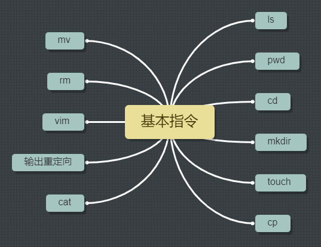
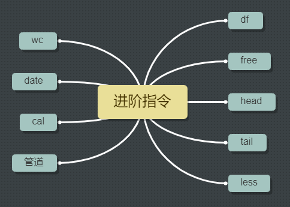
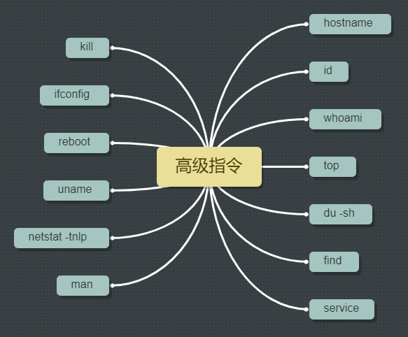

# Linux操作入门

**指令查找：man.linuxde.net/指令名称**

## Linux指令

### 指令与选项

**问：**什么是Linux的指令？

**答：**指令是指在Linux终端（命令行）中输入的内容。

一个完整指令的标准格式（Linux通用格式）：

**指令主体   [选项]  [操作对象] **

*说明：*

>一个指令只能有一个指令主体
>
>一个指令可以包含多个选项
>
>操作对象可以是多个

### 基础指令

本节主要讲解了Linux常用的11个基础指令，这些基础指令在Linux终端中，使用频率非常高，请务必牢记并且熟练使用。这些指令分别是:

    

:heart:**ls**（list）

用法：**ls  [选项]  [路径]**

含义：列出当前工作目录下 / 指定路径下所有文件和文件夹的名称

参数说明：选项通常用两种，**l**  、  **a**   和  **h**

颜色说明：**蓝色**的名称表示文件夹，**黑色**的表示文件，**绿色的其权限为拥有所有权限**

~~~JavaScript
ls         // 列举出当前目录下的文件和文件夹
ls ./wan   //列举出当前目录下，wan文件夹中的文件和文件夹
ls  /home  //列举出home根目录下的文件和文件夹
ls -l      //以列表的形式列出当前工作目录下的文件和文件夹
ls -la     //以列表的形式例举出当前工作目录下的文件和文件夹
ls -lh     //以列表的形式列出，并且以更可读的方式显示文件大小
~~~

:heart:   **pwd**（print working directory）

含义：打印当前工作目录

:heart: **cd**（change directory）

含义：用于切换当前的工作目录

~~~JavaScript
cd wan      //切换到当前目录下的wan文件夹中
cd ../wan   //切换到上一级目录中的wan文件夹中
cd /home    //切换到home根目录中
cd ~        //切换到当前用户的根目录
~~~

:heart: **mkdir**（make directory）

语法：**mkdir  路径1  路径2  路径3**

含义：在指定路径下创建文件夹

~~~javascript
mkdir zhou        //在当前工作目录下创建一个名为  zhou 的文件夹
mkdir /home/zhou  //在home根目录下创建一个名为 zhou 的文件夹  
mkdir lan1 lan2   //在当前目录下创建两个文件夹
~~~

:heart: **touch**

语法：**touch 路径/文件名**

含义：在指定的目录创建文件

~~~javascript
touch /home/wan.txt /home/zhou.txt  //在home根目录下创建两个文件
~~~

:heart: **cp**（copy）

语法：**cp  被复制的 文档/文件夹 路径   目的路径**

含义：复制 文件/文件夹  到指定目录

注意1：复制的时候可以顺便更改文件名。建议保持前后名称一致

注意2：复制文件夹的时候需要加 **-r** 选项，从而实现递归复制

~~~javascript
cp wan.txt ./wan/de.txt  //将当前目录下的wan.txt复制到wan中，并改名
cp -r wan zhou           //将wan文件夹及其中的内容复制到zhou文件夹
~~~

:heart: **mv**（move）

语法：**mv 需要移动的文档路径  需要保存的位置路径**

作用：移动文档到新的位置，相当于剪切。也可以重命名。

注意：linux下，改名也是用 **mv**命令

~~~javascript
mv wan.txt ./wan    // 将wan.txt文件移动到wan文件夹中
mv wan ./zhou/wan   // 将wan文件夹移动到  ./zhou/wan 目录
mv wan wan1         // 将wan文件夹的名称改为wan1
~~~

:heart: **rm**（remove）

语法：**rm 选项  需要移除的文档路径**

作用：移除/删除 文档

选项：**-r **（recursion）    **-f**（force）。删除一个目录的时候需要做递归删除，并且一般也不需要进行删除确认询问，所以移除目录的时候一般需要使用：rm -rf

~~~javascript
rm text.txt      //删除名为text.txt的文件，会弹出询问
rm -f text.txt   //删除名为text.txt的文件，不会弹出询问
rm -rf  wan      //删除文件夹，并且不弹出询问
rm -rf  images*  //使用通配符进行删除符合条件的文件或者文件夹
~~~

:heart: **vim**命令

语法：**vim 文件的路径**

说明：打开文件。（vim是Linux的一款编辑器）

退出：**shift + :**  然后输入  **q**

:heart: **输出重定向**

一般命令的输出都会显示在终端中，有些时候需要将一些命令的执行结果保存在文件中进行后续的分析或者统计，则需要输出重定向。

语法：**正常执行的指令   >/>>  文件的路径**

~~~JavaScript
>  :覆盖输出
>> :追加输出，不会覆盖原始文件的内容，会在内容末尾继续添加
ls -la > ls.txt       //将ls -la的查询结果存储到ls.txt文件中
ls -la >>ls.txt       //将ls -la的查询结果追加到ls.txt文件中	
~~~

:heart: **cat**

语法1：查看一个文件内容

作用1：**cat  文件路径**

~~~javascript
cat wan.txt       //查看wan.txt中文件内容
~~~

语法2：**cat 待合并的文件路径1  待合并的文件路径2    .....   待合并的文件路径n  >  合并之后的路径**

作用2：cat还可以对文件进行合并

~~~javascript
cat wan.txt zhou.txt > zhou.txt   //将wan.txt和zhou.txt文件合并到zhou.txt文件中
~~~

### 进阶指令 

本节讲解了Linux的一些进阶指令，这些指令使用情况比基础指令使用较少，但也是需要熟练掌握的指令。

    

:heart: **df**

语法：**df  -h**

作用：查看磁盘空间

:heart:**free **

语法：**free  -m**

作用：查看内存使用情况

选项说明：**-m**表示以m为单位进行查看

:heart:**head**

语法：**head -n  文件路径**

作用：查看一个文件的前n行，如果不指定，则默认显示前10行

:heart:**tail**

语法1：**tail -n 文件路径**

作用1：查看一个文件的末尾n行，如果n不指定就默认显示后10行

语法2：**tail -f 文件路径**

作用2：可以通过tail指令来查看一个文件的动态变化（系统添加的内容），一般用于查看系统日志。

**:heart:less**

语法：**less 需要查看的文件路径**

作用：查看文件，以较少的内容进行输出，按下辅助功能键（1.**数字 + 回车**；2.**空格键  + 上下方向键**）查看更多。

**:heart:wc**

语法：**wc -lwc  需要统计的文件路径**

作用：统计文件内容信息（包括行数、单词数、字节数）

**:heart:date（重点）**

语法：**date 格式**

作用：操作时间和日期（读取、设置）

~~~javascript
date              //查看当前时间
date +%F          //查看当前时间，显示 年-月-日,(等价与 date "%Y-%m-%d")
date "+%F%T"      //引号表示让“年月日与时分秒”成为一个不可分割的整体，输出：年-月-日 时:分:秒，
			      //等价于：date "+%Y-%m-%d %H:%M:%S"
date "-1 day" "+%Y-%m-%d %H:%M:%S" //获取当前往前推1天的时间，+号表示之后，单位有day、year、mouth
~~~

传送门：https://man.linuxde.net/date

*格式说明：*

>%F：表示完整的年月日
>
>%T：表示完整的时分秒
>
>%Y：表示四位年份
>
>%m：两位月份（前导0）
>
>%d：表示日期（前导0）
>
>%H：表示小时（前导0）
>
>%M：表示分钟（前导0）
>
>%S：表示秒（前导0）

**:heart:cal**

语法：**cal  格式**

作用：用来操作日历

:heart:**clear/Ctrl + L**

语法：**clear** 或者 **Ctrl + L**

作用：清楚终端中已经存在的命令和结果（信息）。

说明：该命令并不是真的清楚了之前的信息，而是把之前的信息隐藏到了最上面，通过滚动条继续查看以前的信息。

:heart:**管道（重要）**

管道符： **|**

作用：管道可以用于”**过滤(grep)**“，”特殊“，”扩展处理“

语法：管道不能单独使用，必须配合其他指令使用，其作用为辅助作用。

~~~JavaScript
// 通过管道查询home根目录下包含“wan”字母的文档名称
ls /home|grep w
~~~

~~~javascript
// 统计当前目录下文档的总个数
ls | wc -l
~~~

### 高级指令

    

**:heart:hostname**

作用：（**读取**和设置）操作服务器的主机名

语法：**hostname**        输出完整主机名

​		   **hostname -f**     输出当前主机名中的FQDN（全限定域名）

:heart:**id**

作用：查看一个用户的一些基本信息（包含用户id、用户组id、附加组id...），如果不指定用户，则显示当前用户的信息。

语法：id    用户名

~~~javascript
id               //默认显示当前用户的基本信息
id  wan          //显示用户wan的信息
~~~

**问：**如何验证上述指令输出的信息是否正确？

验证用户信息：   通过文件  /etc/passwd

验证用户组信息：通过文件/etc/group

:heart:**whoami**

作用：显示当前登录的用户名。shell脚本使用较多，一般用于获取当前操作的用户名，以便日志记录。

语法：**whoami**

**:heart:ps -ef（重点）**

作用：主要用于查看服务器的进程信息

选项含义：**-e**，等价于"-A"，表示例举出全部的进程。

​					**-f**，表示显示全部的列（显示全字段）。

列的含义：**UID**：该进程执行的用户id

​					**PID**：进程id

​					**PPID**：该进程的父级进程id，如果一个程序的父进程找不到，该进程称为僵尸进程

​					**C**：CPU的占用率，其形式为百分比

​					**STIME**：该进程的启动时间

​					**TTY**：终端设备，如果显示“？”，则表示不是由终端发起

​					**TIME**：进程的执行时间

​					**CMD**：该进程的名称，或者对应的路径

~~~javascript
//在ps的结果中过滤想要查看的进程状态,gnome-panel为进程名称
ps -ef|grep gnome-panel   
//查看火狐进程
ps -ef|grep firefox
~~~

**:heart:top（重点）**

作用：查看服务器的进程占用资源

语法：**top **           进入命令，q退出

**:heart:du -sh**

作用：查看目录的真实大小

选项含义：**-S**：summaries，只显示汇总的大小

​					**-h**：表示以高可读性的形式进行显示

语法： **du -sh 路径**

~~~javascript
//统计 /home 目录的真实大小
~~~

**:heart:find**

作用：用于查找文件（其参数有55个）

语法：**find 路径范围  选项  选项的值**

选项：**-name**:   按照文档名称进行搜索（支持模糊搜索）

​			**-type**:     按照文档的类型进行搜索。“**-**”表示文件（在使用find的时候需要使用f来替代），“**d**”表示文件夹

~~~JavaScript
find /home -name *.txt         //找到/home路径下，后缀为txt的文件
find /home -name *.txt|wc -l   //统计/home路径下，后缀为txt的文件的总数
find /hoem -type d             //查找 /hemo路径下，所有的文件夹
~~~

**:heart:service（重要）**

作用：用于控制一些软件的服务 **启动/停止/重启**

语法：**service 服务名 start/stop/restart**

~~~javascript
service https start           //启动本机安装的apache(网站服务软件)
service mysql start           //启动mysql服务
~~~

**:heart:kill**

作用：表示杀死进程（当遇到僵尸进程或者出于某些原因需要关闭进程的时候）

语法：**kill  进程PID**  （语法需要配合ps一起使用）

~~~JavaScript
ps -ef|grep httpd   //
kill 29867          //
~~~

与kill命令作用相似但是比kill更加好用的杀死进程的命令：killall

语法：**killall 进程名称**

**:heart:ifconfig（重点）**

作用：用于操作网卡相关的指令

语法：ifconfig         （获取网卡信息）

注意：inet addr就是网卡的ip地址

**:heart:reboot**

作用：重新启动计算机

语法1：**reboot**        重启

语法2：reboot  -w  模拟重启，但是不重启（只写关机和开机的日志信息）。

**:heart:shutdown**

作用：关机  （慎用）

语法：**shutdown -h now**  或者   **shutdown  -h 15:25**

~~~javascript
//设置Linux系统关机时间在12:00
shutdown -h 12:00 "系统将在12:00关机，请保存好你的文档"
~~~

**:heart:uname**

作用：获取计算机操作系统相关的信息

语法1：**uname**  获取操作系统的类型

语法2：**uname -a**  表示获取全部的系统信息

**:heart:netstat -tnlp**

作用：查看网络连接状态

选项：**-t**：表示只列出tcp协议的连接

​			**-n**：表示将地址从字母组合转化成ip地址，将协议转化成端口号显示

​			**-l**：表示过滤出“state”列中，其值为listen（监听）的连接

​			**-p**：表示显示发起连接的进程pid和进程名称

**:heart:man**

作用：manul，包含了Linux中全部命令的手册（英文）

语法：**man 命令**     （按 q退出）

~~~javascript
//通过man命令查询cp指令的用法
man cp
~~~

## 指令练习

- 如何通过命令行重启Linux操作系统？

- 如何在命令中快速删除光标 **前/后**的内容？ Ctrl + u   Ctrl + k
- 如何删除 /home/wan 下所有 w 开头的文件?
- （备份系统重要文件），如何把 /home/wan 备份到 /home/zhou 目录下？
- 如何查看系统最后创建的3个用户？
- 什么命令可以统计当前系统中一共有多少账户？
- 如何创建 /home/wan/wan.conf 文件？
- 如何通过 vim 编辑器打开 /home/wan/wan.conf ？
- 如何查看 /home/wan/wan.conf 的头3行和尾3行？
- 如何一次性创建目录  /wan/zhou/luo/test.txt ?
- 如何最快的返回当当前用户的根目录？
- 如何查看  /etc 所占用的磁盘空间？
- 如何删除  /home/wan 下所有的文件？
- 启动mysql的服务，并且检查是否启动成功。 
- 使用已学命令杀死mysql的进程。

## vim编辑器

