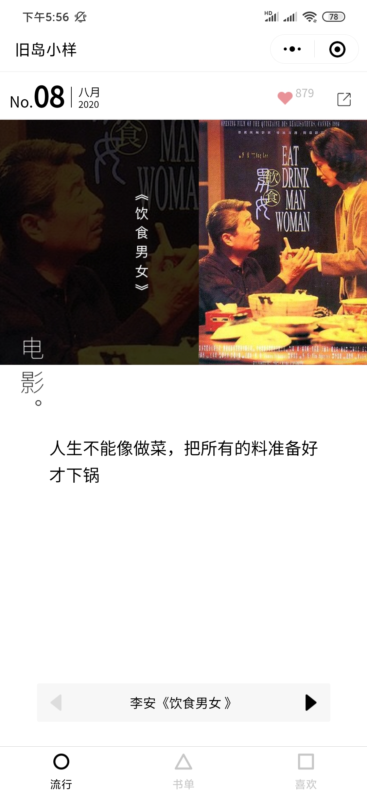
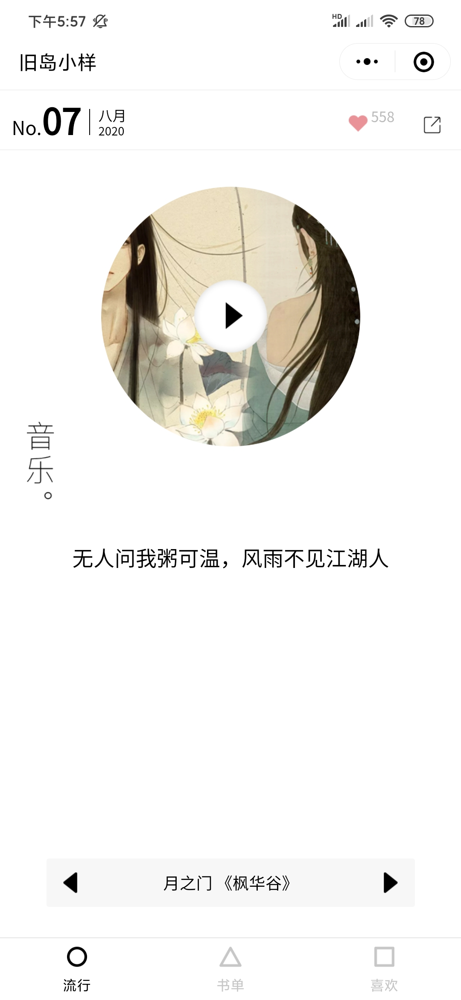
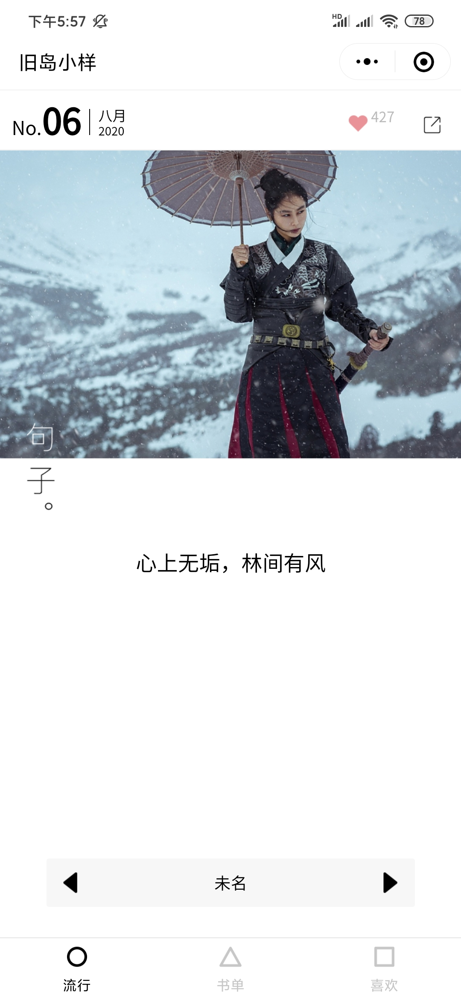

# 微信小程序组件式编程项目实践

## 1 接口文档

- Blink Api

## 2 帮助文档

- 小程序开发文档
- mdn
- 阿里巴巴字体 iconfont

## 3 项目骨架搭建

**新建小程序项目**

- 填入自己的appid

**搭建目录结构**

| 目录名     | 作用                   |
| ---------- | ---------------------- |
| components | 自己编写的组件         |
| images     | 项目用到的图片（图标） |
| models     | 模型类                 |
| pages      | 页面                   |
| util       | 自己编写的帮助库       |

**搭建项目页面**

| 页面名称         | 名称           |
| ---------------- | -------------- |
|                  | about          |
| 书单页面         | book           |
| 书籍详情         | book-detail    |
| 流行（期刊）页面 | classic        |
| 期刊详情         | classic-detail |
| 课程页面         | course         |
| 我的             | my             |

**准备静态图片资源**

**项目配置**

~~~javascript
{
  "pages": [
  ],
  "window": {
    "navigationBarBackgroundColor": "#ffffff",
    "navigationBarTitleText": "林间有风",
    "navigationBarTextStyle": "black",
    "navigationStyle": "default",
    "backgroundColor": "#ffffff",
    "enablePullDownRefresh": false
  },
  "tabBar": {
    "selectedColor": "#000000",
    "backgroundColor": "#ffffff",
    "color": "#c7c7c7",
    "list": [
      {
        "selectedIconPath": "/images/tab/classic@highlight.png",
        "pagePath": "pages/classic/classic",
        "text": "流行",
        "iconPath": "/images/tab/classic.png"
      },
      {
        "pagePath": "pages/book/book",
        "selectedIconPath": "/images/tab/book@highlight.png",
        "iconPath": "/images/tab/book.png",
        "text": "书籍"
      },
      {
        "pagePath": "pages/my/my",
        "selectedIconPath": "/images/tab/my@highlight.png",
        "iconPath": "/images/tab/my.png",
        "text": "喜欢"
      }
    ]
  },
  "requiredBackgroundModes": [
    "audio"
  ],
  "sitemapLocation": "sitemap.json"
}
~~~

## 4 API请求类编写

~~~javascript
import {config} from '../config'

const tips = {
    1:'出现了一个错误',
    1000:'输入参数错误',
    1001:'输入的json格式不正确',
    1002:'找不到资源',
    1003:'未知错误',
    1004:'禁止访问',
    1005:'不正确的开发者key',
    1006:'服务器内部错误'
}

class HTTP {
    request({url,data,method='get'}){
        console.log(url)
        return new Promise((resolve,reject)=>{
            wx.request({
                url:`${config.api_base_url}${url}`,
                header: {
                    appkey:"AbhC31IG7ruCDp57"
                },  
                data:data,   
                method:method,                
                success: (result)=>{
                    console.log(result)
                    resolve(result.data)
                },
                fail: (err)=>{
                    reject(err)
                },
                complete: ()=>{}
            });
        })
    }

    _ShowErrorInfo(code){
        if (!code){
            code = 1
        }
        wx.showToast({
            title: tips[code],
            duration: 1500,
        });
    }
}

export {HTTP}
~~~

作为小程序与外部进行数据交换的唯一枢纽，我将 `HTTP` 请求及其相关流程用类的方式来实现。`API` 请求需要处理的是请求参数和返回结果。每一次请求所传递的参数都是不一样的，如何才能更好的设置请求参数。我选择在 `HTTP` 请求类中作处理，让一些可选参数尽量少在业务中添加。`URL` 的构造采用拼接的方式，基础 `URL` 写在配置文件中，在业务中只需要向 `HTTP` 类传递简写的请求地址即可。对于返回结果，一个是正确的结果的解析，另一个是错误响应的提示。

由于微信小程序的 `request` 接口并没有提供同步的方式，为了我们在写业务时调用方便，我们在 `HTTP` 类中，将请求改装成 `Promise` 的形式，这样我们在业务中可以使用 `async` - `await` 的方式实现同步调用接口。

## 5 流行页面

    
    
    

流行页面有三种不同期刊类型的显示，每种期刊的显示方式不一样，因此需要使用不同的组件。除了期刊本身的显示方式以外，其它的组件均一致，使用到的组件总结如下：

期刊号和日期组件（`episode`）、喜欢组件（`like`）、导航组件（`navi`）、电影组件（`movie`）、音乐组件（`music`）、句子组件（`sentence`）。分别完成这些组件的编写，以及在流行页面使用编写的组件之后，该页面的功能就大致实现了。

**ClassicModel**

~~~javascript
import {HTTP} from '../utils/http'

class ClassicModel extends HTTP{
    async getLastestClassic(params){
        let lastestClassicIndex = wx.getStorageSync('lastestIndex');
        if (lastestClassicIndex){
            let lastestClassic = wx.getStorageSync('Classic-'+lastestClassicIndex);
            if (lastestClassic){
                return lastestClassic
            }
        }
        let res = await this.request({...params})
        let key = this._getKey(res.index)
        wx.setStorageSync(key, res);
        this._setLastestIndex(res.index)
        return res
    }

    async Like(params){
        let res = await this.request({...params})
        return res
    }
    async LikeCancel(params){
        let res = await this.request({...params})
        return res
    }

    _getKey(index){
        return 'Classic-' + index
    }
    _setLastestIndex(index){
        wx.setStorageSync('lastestIndex',index)
    }

}

export {ClassicModel}
~~~

`HTTP` 类作为整个小程序发起 `API` 请求以及接收响应的工具类，它无法兼顾到每一个业务的细节。我们可以像后端开发一样引入模型类，该模型类主要封装该模型相关的各种 `API` 请求函数，比如  `ClassicModel` 模型类，里面封装了与 `Classic` 相关的 `API` 的请求函数。

**like组件**

样式设计：

~~~javascript
<!--components/like/like.wxml-->
<view class="container">
    <image class="img" src="{{like_status?img_dis:img_hid}}" bindtap="LikeAction"/>
    <text class="fav_nums">{{fav_nums}}</text>
</view>
~~~

~~~javascript
/* components/like/like.less */
.container{
    .img{   
        width: 32rpx;
        height: 32rpx;
    }
    .fav_nums{
        vertical-align: 20rpx;
        font-size: 26rpx;
        color: rgb(185, 185, 185);
    }
}
~~~

在 `like` 组件的样式设置中需要注意的是图片的大小需要手动设置，若未手动设置图片大小，则图片会以微信的默认图片大小来显示。

组件控制代码：

~~~javascript
// components/like/like.js
Component({
  /**
   * 组件的属性列表
   */
  properties: {
    fav_nums:{type:Number},
    like_status:{type:Boolean}
  },

  /**
   * 组件的初始数据
   */
  data: {
    img_dis:'./images/like.png',
    img_hid:'./images/like@dis.png'
  },

  /**
   * 组件的方法列表
   */
  methods: {
    LikeAction(e){
      let like_status = this.properties.like_status;
      let fav_nums = this.properties.fav_nums;
      
      like_status = !like_status;
      like_status?++fav_nums:--fav_nums;

      this.setData({
        like_status
      })

      this.triggerEvent('LikeAction',{
        operation:like_status?'like':'cancel'
      },{})
    }
  }
})
~~~

组件的属性有两种，一种是外部传入属性，写在 `properties` 里，另一种是组件自身属性，属于 `data` 对象。`like` 的外部属性有内容被喜欢总数 `fav_nums` 和当前用户是否喜欢该内容 `like_status`。外部属性是喜欢和未喜欢两种状态的图片链接。这里可以根据 `like_status` 的值来选择显示哪一张图片。

当用户点击喜欢图标时会触发 `LikeAction` 事件，这该事件中对图标显示状态进行切换，对内容被喜欢总数进行修改，并且使用 `triggerEvent` 方法，触发使用该组件页面的对应函数，通知喜欢状态的改变。

页面引入组件：

~~~javascript
{
  "usingComponents": {
    "my-like":"../../components/like/like"
  }
}
~~~

页面或者组件想要使用某组件时，需要在页面配置文件中引入目标组件，引入代码如上所示。

页面使用组件：

~~~javascript
<!--pages/classic/classic.wxml-->
<my-like fav_nums="{{Classic.fav_nums}}" like_status="{{Classic.like_status}}" bindLikeAction="LikeAction"></my-like>
~~~

组件引入成功后，可以在 WXML 文件中使用组件，注意观察父向子传递参数，以及子组件触发父组件（或者页面）事件的方式。

**episode组件**

样式设计：

~~~javascript
<!--components/episode/episode.wxml-->
<view class="container">
    <view class="index-container">
        <text class="lable">No.</text>
        <text class="index">{{index<10?'0'+index:index}}</text>
        <text class="plain"></text>
    </view>
    <view class="date-container">
        <text class="mouth">{{mouthList[mouth]}}</text>
        <text class="year">{{year}}</text>
    </view>
</view>
~~~

在 WXML 代码中，有两个地方需要注意：一是期刊号不满10的期刊，显示的时候需要在前面补零；二是字符串格式的自然数月份转中文的月份，这里采用一个对象来作映射。

~~~javascript
/* components/episode/episode.wxss */
.container{
    display: flex;
    
    .index-container{
        display: flex;
        align-items: baseline;
        height: 60rpx;
        .lable{ 
            font-size: 26rpx;
        }
        .index{
            font-size: 60rpx;
            height: 60rpx;
            line-height: 60rpx;
            font-weight: 600;
        }
        .plain{
            margin:0 10rpx;
            border-right: 1px solid black;
            height: 44rpx;
        }

    }
    .date-container{
        display: flex;
        flex-direction: column;
        align-items: center;
        justify-content: space-around;
        font-size: 18rpx;
        .mouth{

        }
        .year{

        }
    }
}
~~~

在样式代码中也有两个点需要留意，一是基线没对齐的盒子里的元素，可以将该盒子设置为 `flex` 布局，然后设置非主轴方向的对齐方式为 `align-items: baseline;`;另外，要实现如期刊号和日期之间的分割竖线，直接才左边或者右边的盒子设置边框可能会问题，其竖线会高于盒子中元素的高度，那么可以增加一个空元素，将这个元素的高度设置略低于左右盒子，然后给该空元素设置边框即可。

组件控制代码：

~~~JavaScript
// components/episode/episode.js
Component({
  /**
   * 组件的属性列表
   */
  properties: {
    index:{
      type:Number
    },
    pubdate:{
      type:String
    }
  },

  /**
   * 组件的初始数据
   */
  data: {
    mouth:'',
    year:'',
    mouthList:{
      '01':'一月',
      '02':'二月',
      '03':'三月',
      '04':'四月',
      '05':'五月',
      '06':'六月',
      '07':'七月',
      '08':'八月',
      '09':'九月',
      '10':'十月',
      '11':'十一月',
      '12':'十二月',
    }
  },

  observers:{
    'pubdate':function(pubdate){
      this.setData({
        year:pubdate.slice(0,4),
        mouth:pubdate.slice(5,7),
      })
    }
  },

  /**
   * 组件的方法列表
   */
  methods: {

  }
  
})
~~~

在组件的逻辑控制代码中，接收两个外部属性：`index` 和 `pubdate`，三个组件自身属性：`mouthList`、`mouth` 和`year`。`mouth` 和 `year` 利用数据监听器，根据 `pubdate` 的值来设置值。

**navi组件**

样式设计：

~~~javascript
<!--components/navi/navi.wxml-->
<view class="container">
    <image class="left" src="{{previous?icons['left']:icons['leftHidden']}}" bindtap="PreviousTap"/>
    <text class="title">{{title}}</text>
    <image class="right" src="{{next?icons['right']:icons['rightHidden']}}" bindtap="NextTap"/>
</view>
~~~

~~~javascript
/* components/navi/navi.wxss */
.container{
    width: 80%;
    display: flex;
    margin:0 auto;
    background-color: rgb(243, 243, 243);
    border-radius: 5rpx;
    .left{
        flex: 1;
        width: 80rpx;
        height: 80rpx;
    }
    .title{
        flex: 7;
        display: flex;
        justify-content: center;
        align-items: center;
        font-size: 28rpx;
    }
    .right{
        flex: 1;
        width: 80rpx;
        height: 80rpx;
    }
}
~~~

要想让盒子内部的元素水平和垂直居中（比如让一个 `view` 里面的文字居中），可以将盒子的显示方式设置为 `flex` ，然后通过 `justify-content: center;`  和  `align-items: center;` 让其居中。

组件控制代码：

~~~javascript
// components/navi/navi.js
Component({
  /**
   * 组件的属性列表
   */
  properties: {
    title:{
      type:String
    },
    next:{
      type:Boolean
    },
    previous:{
      type:Boolean
    }
  },

  /**
   * 组件的初始数据
   */
  data: {
    icons:{
      'left':"./images/triangle@left.png",
      'leftHidden':"./images/triangle.dis@left.png",
      'right':"./images/triangle@right.png",
      'rightHidden':"./images/triangle.dis@right.png",
    }
  },

  /**
   * 组件的方法列表
   */
  methods: {
    PreviousTap(){  
      if (!this.properties.previous) {
        return;
      }
      this.triggerEvent('onPrevious',{})
    },
    NextTap(){
      if (!this.properties.next) {
        return;
      }
      this.triggerEvent('onNext',{})
    }
  }
})

~~~

`navi` 组件有三个外部参数 `title`、`next`、`previous`，分别代表期刊的标题、是否还有下一期刊、是否还有前一期刊。一个内部参数 `icons` 用以存放四个按钮图标。`PreviousTap`、`NextTap` 两个事件绑定函数触发父组件的逻辑，进行期刊切换。

组件使用：

~~~javascript
<my-navi bindonPrevious="onPrevious" bindonNext="onNext" title="{{Classic.title}}" next="{{lastestIndex==Classic.index?false:true}}" previous="{{Classic.index===1?false:true}}"></my-navi>
~~~

使用组件时，如果当前期刊号等于 `lastestIndex` ，该期刊为最新一期期刊，故 `next` 为 `false` ，否则为 `true` 。`previous` 在当前期刊号为1时为 `false`。

父组件处理函数：

~~~javascript
  /* 请求前一期期刊 */
  async onPrevious(){
    console.log('onPrevious')
    let res = await classicModel.GetPriviousClassic(this.data.Classic.index);
    console.log(res)
    this.setData({
      Classic:res
    })
  },

  /* 请求后一期期刊 */
  async onNext(){
    console.log('onNext')
    let res = await classicModel.GetNextClassic(this.data.Classic.index);
    console.log(res)
    this.setData({
      Classic:res
    })    
  }
~~~

在 `Classic` 页面的 `onPrevious`函数和 `onNext`函数中，均通过 `classicModel`的方法来获取下一期期刊或者上一期期刊。

**movie组件**

**music组件**

**sentence组件**

