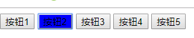
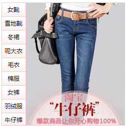
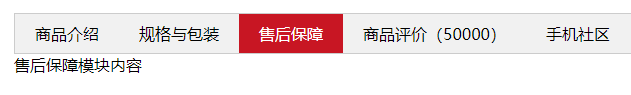

# JQuery快速入门与实战 #

## jQuery介绍与引入

JQuery是一个javascript的框架，是对javascript的一种封装，优化了DOM操作、事件处理、动画设计和ajax交互。通过JQuery可以非常方便的操作html的元素。

**JQuery优点：**

- 轻量级。核心文件才几十kb，不会影响页面加载速度
- 跨浏览器兼容，基本兼容了现在主流的浏览器
-  链式编程、隐式迭代
-  对事件、样式、动画支持，大大简化了DOM操作
-  支持插件扩展开发，有着丰富的第三方插件，例如：树形菜单、日期控件、轮播图等
- 免费开源

**jQuery基本使用**

- 下载
- 测试安装（$.fn.jquery）
- 文档就绪事件
- DOM对象和jQuery对象的区别
- DOM对象和jQuery对象的转换

## jQuery常用API ##

### 基本和层级选择器 ##

原生js获取元素方式很多，很杂，而且兼容性情况不一致，因此jQuery给我们做了封装，使获取元素统一标准。

~~~ javascript
$("选择器") //里面选择器直接写CSS选择器即可，但是要加引号
~~~

**jQuery常用选择器**

|    名称    |     用法      |           描述           |
| :--------: | :-----------: | :----------------------: |
|  ID选择器  |   $("#id")    |     获取指定ID的元素     |
| 全选选择器 |    $("*")     |       匹配所有元素       |
|  类选择器  |  $(".class")  |  获取同一类class的元素   |
| 标签选择器 |   $("div")    | 获取同一类标签的所有元素 |
| 并集选择器 | $("div,p,li") |       选取多个元素       |
| 交集选择器 | $(li.current) |         交集元素         |

 **隐式迭代**

遍历内部DOM元素（伪数组形式存储）的过程就叫做**隐式迭代**。

简单理解：给匹配到的所有元素进行循环遍历，执行相应的方法，而不用我们再进行循环，简化我们的操作，方便我们使用。

### 筛选选择器 ###

**筛选选择器**

|    语法    |     用法      |                           描述                            |
| :--------: | :-----------: | :-------------------------------------------------------: |
|   :first   | $("li:first") |                     获取第一个li元素                      |
|   :last    | $("li:last")  |                    获取最后一个li元素                     |
| :eq(index) | $("li:eq(2)") | 获取到的li元素中，选择索引号为2的元素，索引号index从0开始 |
|    :odd    |  $("li:odd")  |         获取到的li元素中，选择索引号为奇数的元素          |
|   :even    | $("li:even")  |         获取到的li元素中，选择索引号为偶数的元素          |

**筛选选择方法**

| 语法               | 用法                       | 说明                                 |
| ------------------ | -------------------------- | ------------------------------------ |
| parent()           | $("li").parent();          | 查找父级                             |
| children(selector) | $("ul").children("li")     | 相当于$("ul>li")，最近一级（亲儿子） |
| find(selector)     | $("ul").find("li")         | 相当于$("ul li")，后代选择器         |
| siblings(selector) | $(".first").sublings("li") | 查找兄弟节点，不包括自己本身         |
| eq(index)          | $("li").eq(2)              | 相当于$("li:eq(2)")，index从0开始    |

**案例1：**下拉菜单

### JQuery里面的排他思想 ###

要想多选一的效果，排他思想：当前元素设置样式，其余的兄弟元素清楚样式。

**案例2：**使用jQuery实现更换被点击按钮的背景颜色

**案例3：**淘宝服饰精品

*分析：*

> 1.核心原理：鼠标经过左侧盒子某个li，就让内容区盒子相对应图片显示，其余图片隐藏
>
> 2.需要得到当前li的索引号
>
> 3.jQuery得到当前元素索引号$(this).index()
>
> 4.中间对应的图片，可以通过eq(index)方法去选择
>
> 5.显示元素show()  隐藏元素hide()

**链式编程**

~~~ javascript
$("#content div").eq(index).show().siblings().hide();
~~~

### 样式操作 ###

**修改简单元素样式**

- 参数只写属性名，则返回属性值

~~~JavaScript
$(this).css("color")
~~~

- 参数是属性名，属性值，逗号分隔，是一组样式，属性必须加引号，值如果是数字可以不加单位和引号

~~~JavaScript
$(this).css("color","red")
~~~

- 参数可以使对象形式，方便设置多组样式。属性名和属性值用冒号隔开，属性可以不加引号。

~~~JavaScript
$(this).css({
    color:"white",
    width:"100px",
    "height":"100px",
    backgroundColor:"grey",
})
~~~

**设置类样式方法**

- 添加类

~~~JavaScript
$("div").addClass("current");
~~~

- 移除类

~~~javascript
$("div").removeClass("current");
~~~

- 切换类

~~~javascript
$("div").toggleClass("current");
~~~

**案例：**tab栏切换

*分析：*

> 1.点击上部的li，当前li添加current类，其余兄弟移除
>
> 2.点击的同时，得到当前li的索引号
>
> 3.让下部里面相应索引号的item显示，其余的item隐藏

### 属性操作 ###

**设置和获取固有属性值**	

所谓元素固有属性就是元素本身自带的属性，比如<a>元素里面的 href，比如<input>元素里面的 type。

~~~javascript
$("a").prop("title","软件1班")
~~~

**设置和获取元素自定义属性**

用户自己给元素添加的属性，我们称为自定义属性。比如给div添加 index = "1"

~~~javascript
$("div").attr("index")
~~~

**案例：**购物车-全选

*分析*：	

> 1.全选思路：里面3个小的复选框按钮（j-checkbox）选中状态（checked）跟着全选按钮（checkall）走。
>
> 2.因为checked是复选框的固有属性，此时就需要我们利用prop()方法获取和设置该属性。
>
> 3.把全选按钮状态赋值给三个小的全选框。
>
> 4.当我们每次点击小的复选框，就执行下一步的判断：
>
> 5.如果小复选框被选中的个数等于3就应该把全选按钮选上，否则全选按钮不选。
>
> 6.:checked选择器    :checked查找被选中的表单元素。

### 	内容文本值 ###

**普通元素内容**

~~~JavaScript
$("div").html()           //获取元素内容
$("div").html("内容")     //设置元素内容
~~~

**普通元素文本内容**

~~~javascript
$("div").text()          //获取元素文本内容
$("div").text("内容")          //设置元素文本内容
~~~

**表单的值**

~~~JavaScript
$("input").val()         //获取表单元素的值
$("input").val("内容")
~~~

**案例：**购物车-增减商品数量

*分析：*

>核心思路：首先声明一个变量，当我们点击+号（increment），就让这个值 ++ ,然后赋值给文本框
>
>注意1：只能增加本商品的数量，就是当前+号文本框（itxt）的值
>
>修改表单的值用val()方法
>
>注意2：这个变量初始值应该是这个文本框的值，在这个值的基础上++。得先获取表单的值
>
>减号（decrement）思路同理，但是如果文本框的值是1，就不能再减了。

**案例：**购物车-修改商品小计

*分析*：

>核心思路：每次点击 + 号或者 - 号，根据文本框的值乘以当前商品的价格，就是商品的小计
>
>注意1：只能增加本商品的小计，就是当前商品的小计模块(p-sum)
>
>修改普通元素的内容是text()方法
>
>注意2：当前商品的价格，要把￥符号去掉再截取字符串substr(1)
>
>parents('选择器')可以返回指定祖先元素
>
>最后计算的结果要想保留2位小数，使用toFixed(2)方法
>
>用户也可以直接修改表单里面的值，同样需要计算小计。用表单change事件

### 元素操作 ###

#### 元素遍历 ####

jQuery隐式迭代是对同一类元素做了同样的操作。如果要想给同一类元素做不同的操作，就需要用到遍历。

**语法一：**

~~~JavaScript
$("div").each(function(index,domElm){
    XXX;
})
~~~

- each()方法遍历匹配每一个元素
- 回调函数接收两个参数：index是每个元素的索引号；domElem是每个DOM元素对象，而不是jQuery对象。

**案例：**当前有5个p元素，分别给每个p元素的文本内容设置不同的字体颜色

**语法二：**

~~~ JavaScript
$.each(arr or object,function(index,element){
    XXX;
})
~~~

- $each()方法可用于遍历任何对象。主要用于数据处理，比如数组，对象
- 里面的函数有2个参数：index是每个元素的索引号；element建立内容。

**案例：**购物车-总计和总额计算

*分析：*

>核心思路：把所有文本框里面的值相加就是商品总数。总额同理。
>
>文本框里面的值不相同，如果想要相加需要用到each遍历。声明一个变量，相加即可。
>
>点击 + 号或者 - 号，会改变总计和总额，如果用户修改了文本框里面的值，同样会改变总计和总额。
>
>因此可以封装一个函数，求总计和总额，以上操作调用该函数即可。
>
>注意1：总计是文本框里面的值相加用val()，总额是普通元素的内容用text()
>
>要注意，普通元素里面的内容要去掉￥并且转换成数字型才能相加。

#### 创建元素 ####

#### 添加元素 ####

#### 删除元素 ####

**案例：**购物车-删除商品模块

*分析：*

>核心思路：使用remove()删除元素即可
>
>有三个地方需要删除：1.商品后面的删除按钮；2.删除选中的商品；3.清理购物车
>
>商品后面的删除按钮：一定是删除当前的商品，所以从$(this)出发
>
>删除选中的商品：先判断小的复选框按钮是否选中，如果选中，则删除对应的商品

**案例：**购物车-选中商品添加背景颜色

*分析：*

> 核心思路：选中的商品添加背景，不选中的移除背景
>
> 全选按钮点击：如果全选是选中的，则所有的商品添加背景，否则移除背景
>
> 单个商品的复选框点击：如果是选中状态，则当前商品添加背景，否则移除背景
>
> 这个背景，可以通过类名修改，添加类和删除类

### 尺寸和位置操作 ###

**jQuery尺寸**

| 语法                                 | 用法                                                  |
| ------------------------------------ | ----------------------------------------------------- |
| width() / height()                   | 取得匹配元素宽度和高度值，只算width / height          |
| innerWidth / innerHeight()           | 取得匹配元素宽度和高度值，包含padding                 |
| outerWidth() /outerHeight()          | 取得匹配元素宽度和高度值，包含padding、border         |
| outerWidth(true) / outerHeight(true) | 取得匹配元素宽度和高度值，包含padding、border、margin |

*注意：*

- 以上参数为空，则是获取相应值，返回的是数字型
- 如果参数为数字，则是修改相应值
- 参数可以不必写单位

## jQuery事件操作 ##

### 事件注册 ###

**1.单个事件注册**

语法：

~~~javascript
element.事件(function(){})  比如：

$('div').click(function(){
    事件处理程序
})
~~~

其他事件和原生基本一致。

比如：mouseover、mouseout、blur、focus、change、keydown、keyup、resize、scroll等

**2.事件处理on()绑定事件**

on()方法在匹配元素上绑定一个或多个事件处理程序

语法：

~~~javascript
element.on(events,[selector],fn)   //事件处理程序相同

//事件处理程序不同时
element.on({
    事件:function(){
        
    },
    事件:function(){
    
	}
})
~~~

- events:一个或多个用空格分隔的事件类型，如“click”或"keydown"。

- selector：元素的子元素选择器

- fn:回调函数，即绑定在元素身上的侦听函数。

  

**on()方法优势1：**可以绑定多个事件

**on()方法优势2:**可以事件委派操作。事件委派的定义就是，把原来加给子元素身上的事件绑定在父元素身上，就是把事件委派给父元素

**on()方法优势3：**动态创建元素，click() 没有办法绑定事件，on()可以给动态生成的元素绑定事件	

### 事件解绑 ###

off()方法可以移除on()方法添加的事件处理程序。只想触发一次的事件，可以使用one()方法来绑定事件

~~~javascript
$("p").off()             //解绑 p 元素所有的事件处理程序
$("p").off("click")      //解绑p元素上面的点击事件，后面的off是侦听函数名
$("ul").off("click","li")//解绑事件委托
 
//使用one()方法，绑定只需要触发一次的事件
$("p").one("click",function(){       
    alert(111)
})  
~~~

### 自动触发事件 ###

